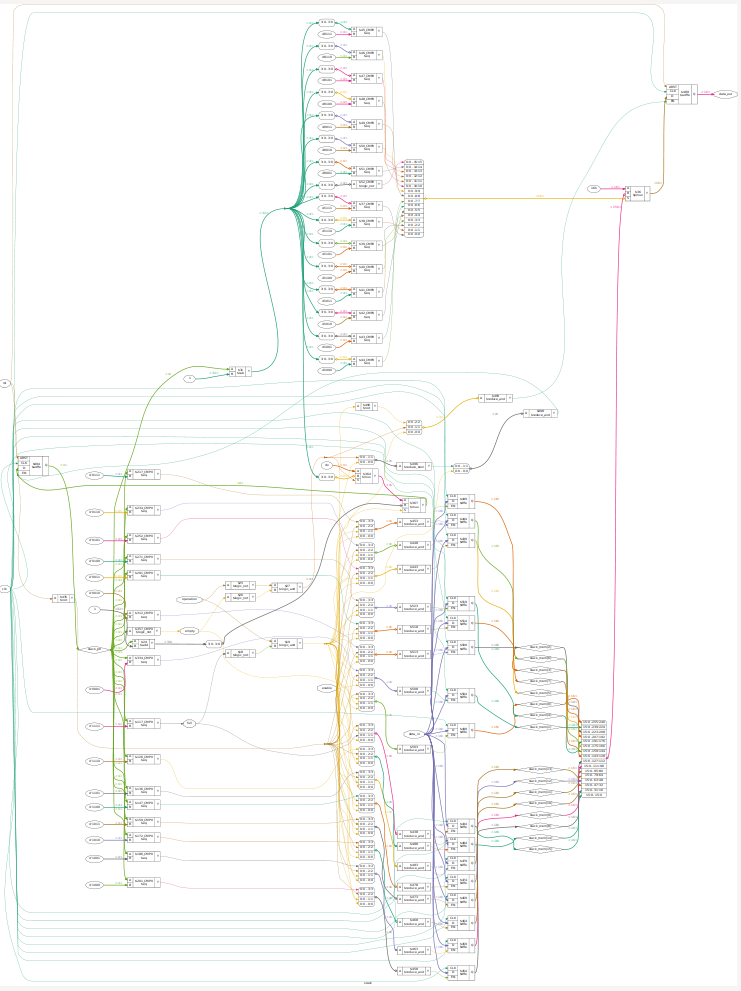
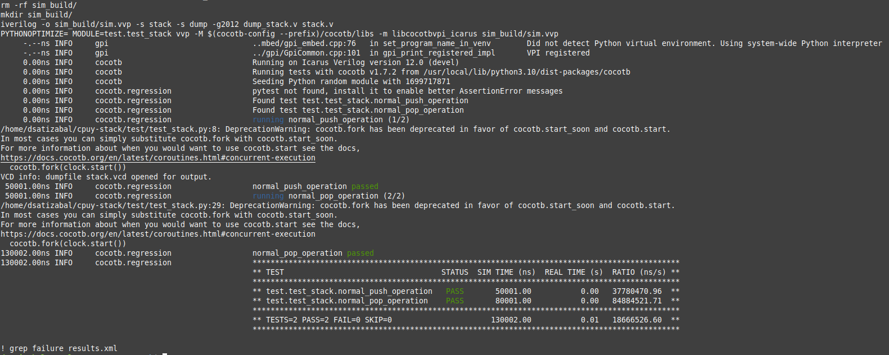
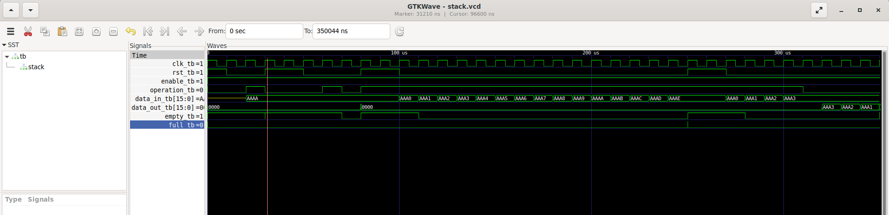

# Simple 16-bits 16-levels stack

Implements a stack that can be used for a CPU implementation, intended to be used in a simple 8-bits CPU implementation to be sent for Tapeout with the [Dec 2023 Efabless shuttle](https://efabless.com/gf-180-open-mpw-shuttle-program)

## Inputs and Outputs description:

- **clk**: input of CPU clock
- **rst**: reset signal
- **enable**: enables stack for operation
- **operation**: indicates the operation, 0 is pop, 1 is push
- **data_in**: sets the address to be poped into the stack
- **data_out**: holds the address pushed out of the stack
- **full**: indicates that stack is full
- **empty**: indicates that stack is empty

## Operation:

If the *rst* signal is driven high for at least one clock cycle the stack is resetted in a way that the *stack pointer* (internal) and *data out* (output) registers are set to zero. The *empty* signal is set to 1 if *stack pointer* is in zero, so with a reset this signal must also be driven low, similarly, the *full* signal is driven high only when the *stack pointer* reaches the **FFh** value, so in a reset event this signal will be driven low.

Observe that the internal array of registers used to hold the pushed addresses (*stack_mem*) is neither initialized nor set to any value with a reset event, and this is not important as values read from that memory will only will be available if a **push** operation is performed first, and in no way *stack_mem* location that has not been previously written by a **push** operation will be accesible from the outside.

If the *enable* signal is set to low the stack won't perform any operation other than reset, so it can be somehow considered as isolated from the external system, so the CPU will have to control that the **push** operation is performed properly.

When 15 **push** operations had been performed, the stack pointer will reach the **FFh** value indicating the stack being full and inhibiting any further **push** attempts, it is responsability of the CPU to verify that, if a **push** is attempted with the full flag being 1, to throw the [stack overflow](https://stackoverflow.com) event or give it the propper handling.

## Synthetizing with YoSys:

Run:

```
make synth_stack
```

and you should see a YoSys window opening showing the synthesis like this (kind of complex this one :S):



observe this synth does not use standard cells.

## Running CocoTB tests:

Type the following command to run tests:

```
make test_stack
```

you should see a result like this:



Observe in the Makefile that a dump_stack.v file is included and used to run the test command, in that file, the output file and the variables to be dumped (the name of the top module) are defined, after running the test the corresponding .vcd (value change dump) file is created and you can proceed to view it with the GtkWave command:

```
make gtkwave_stack
```

a GtkWave window will open, you should see the hierarchy of the timer containing the available signals that can be displayed for examination, like in our case we're viewing the clk, rst, enable, operation, data_in, data_out, empty and full:



observe that for this case we're not using a verilog testbench but rather we're testing directly (Design Under Test or DUT for CocoTB) the corresponding modules.

As per 11Nov2023 the timer is having a malfunction that activates the empty/full signals a clock cycle delay.

## Running Formal Verification:

WIP
